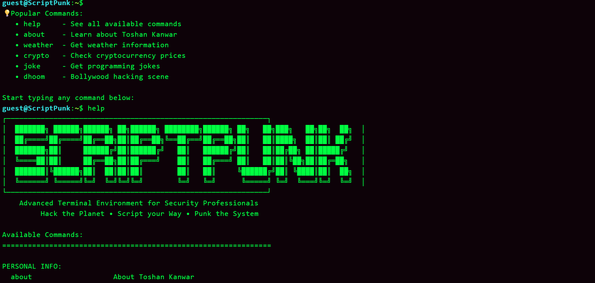
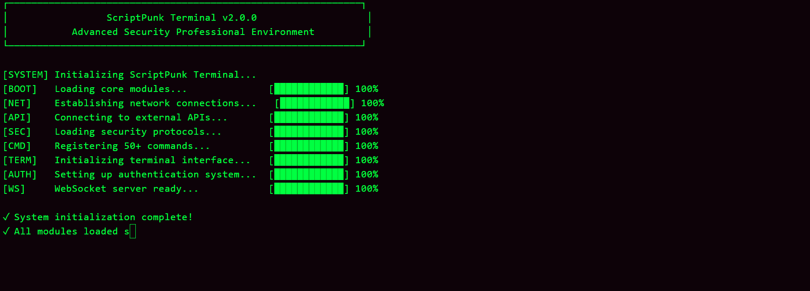
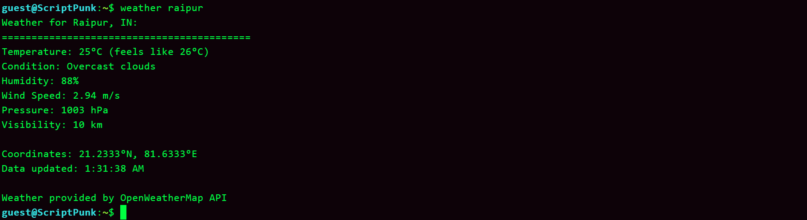
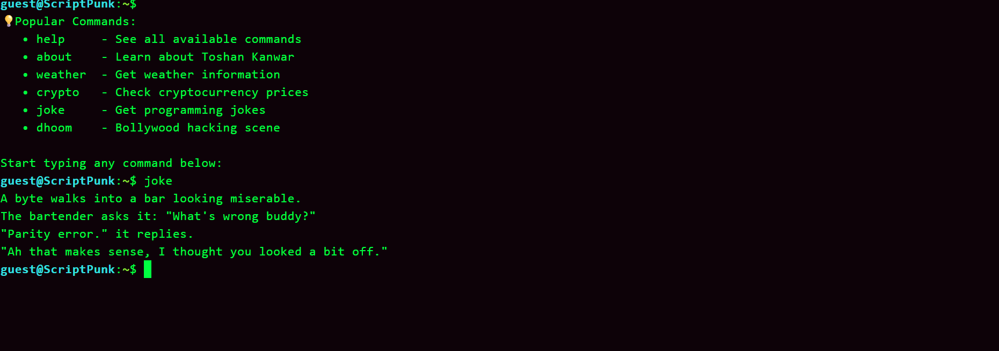

# 🔥 ScriptPunk Terminal

> Advanced web-based terminal with hacking theme and real API integrations

A cutting-edge terminal emulator built with **React + TypeScript** frontend and **Go** backend. Features 50+ interactive commands, Bollywood-inspired hacking simulations, and professional developer tools.

## 🌟 Live Demo

**🔗 [Try ScriptPunk Terminal Live](https://terminal.toshankanwar.website/)**

## ✨ Features

- 🎯 **50+ Interactive Commands** - Weather, crypto, jokes, math, text processing
- 🌐 **Real API Integrations** - OpenWeatherMap, CoinGecko, JokeAPI, Hacker News
- 🎬 **Bollywood Hacking Scenes** - Dhoom, Robot 2.0, War Room simulations
- 🔐 **Secure Authentication** - JWT-based login with WebSocket PTY access
- ⚡ **Real-time Terminal** - Professional xterm.js interface
- 🎨 **Cyberpunk Theme** - Matrix rain, animated progress bars, terminal effects

## 🚀 Quick Start

Clone the repository
```bash
git clone https://github.com/toshankanwar/Project-X.git
cd Project X 
```

Frontend (React)
```bash
cd scriptpunk
npm install
npm run dev
```

Backend (Go)
```bash
cd backend
go mod tidy
go run main.go
```

Visit `http://localhost:5173` and type `help` to get started!

## 📸 Screenshots

### Main Terminal Interface


### Startup Animation


### Weather and Crypto Commands


### Joke Commands


## 🎮 Popular Commands
Get started
help # Show all available commands
about # Learn about the developer

API-powered commands
weather delhi # Real weather data
crypto bitcoin # Live crypto prices
joke # Programming jokes
news # Tech headlines

Bollywood hacking fun
dhoom # Dhoom movie hack sequence
robot # Robot 2.0 simulation
matrix # Matrix rain effect
parrot # Dancing parrot animation

Developer tools
password 16 # Generate secure passwords
calc 2**10 + 5 # Mathematical calculator
hash "hello world" # Generate text hashes
encode64 "secret" # Base64 encoding


## 🛠️ Tech Stack

**Frontend:**
- React 18 + TypeScript
- xterm.js for terminal emulation
- Tailwind CSS for styling
- Vite for build tooling

**Backend:**
- Go with Gorilla WebSocket
- JWT authentication
- Real API integrations
- PTY shell access

## 🌟 Live Demo

**🔗 [Try ScriptPunk Terminal Live](https://terminal.toshankanwar.website/)**

Default login credentials:
- **Username:** `hackroot`
- **Password:** `kali`

## 📄 License

MIT License - feel free to use, modify, and distribute!

## 👨‍💻 About

Created by **Toshan Kanwar** - Data Science & AI student at IIIT Naya Raipur

- 🌐 **Website:** [toshankanwar.website](https://toshankanwar.website)
- 💼 **LinkedIn:** [Toshan Kanwar](https://linkedin.com/in/toshan-kanwar-4683a1349/)
- 🐙 **GitHub:** [@toshankanwar](https://github.com/toshankanwar)
- 📺 **YouTube:** [@ToshanKanwarOfficials](https://youtube.com/@ToshanKanwarOfficials)

---

⭐ **Star this repo if you found it helpful!** ⭐


